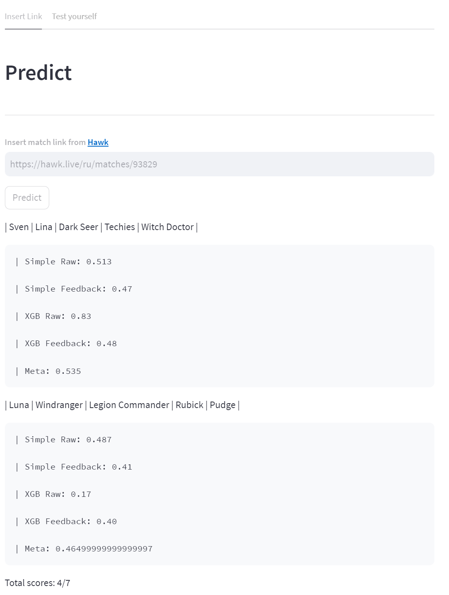

# Dota pick predictor
Project to help you decide witch pick is better in Dota2 matches. 

Contains 2 moduls and StreamLit app. 
To see what this modules can do - check README in them. 

## How to use
Install requirements by running `pip3 install -r requirements.txt`
From your root directory run `streamlit run app.py`

 
 

